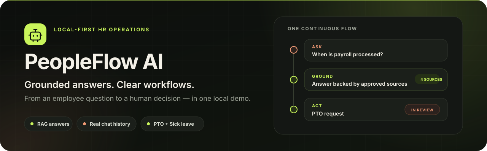

  

  
  
  
  

  <a href="#quick-start"><strong>Quick start</strong></a>
  &nbsp;·&nbsp;
  <a href="#what-to-try">Demo flows</a>
  &nbsp;·&nbsp;
  <a href="#architecture">Architecture</a>
  &nbsp;·&nbsp;
  <a href="#development">Development</a>

PeopleFlow AI is a local-first HR operations demo. Employees ask questions against approved company documents, continue real conversations, request PTO, and report sick leave without leaving one workspace.

Managers keep the decisions. Knowledge admins keep the sources and answer quality under control. Every important state is persisted locally and remains easy to inspect.

> [!NOTE]
> This is a focused tech demo, not a production HRIS. It intentionally proves two complete workflows instead of collecting unfinished features.

## Quick start

**You need:** Windows PowerShell, Git, Python 3.10+, and Node.js 22+.

### 1. Clone

~~~powershell
git clone https://github.com/JDH-d/AI-in-HR_DEMO.git
cd AI-in-HR_DEMO
~~~

### 2. Add your OpenAI key

~~~powershell
Copy-Item .env.example .env
notepad .env
~~~

Replace <code>your_openai_api_key</code>, save the file, and close Notepad. The model defaults are ready to use.

> [!TIP]
> No API key yet? You can still run the demo. It will use deterministic answers and lexical document search.

### 3. Start

~~~powershell
./run_demo.ps1 -InstallDeps
~~~

This one command creates the Python environment, installs backend and frontend dependencies, rebuilds the knowledge index, and starts both services.

When the terminal says <code>Demo services started</code>, open:

**[http://127.0.0.1:5173](http://127.0.0.1:5173)**

Sign in with <code>employee</code> and <code>demo-password</code>. You are ready.

### Demo accounts

All accounts use the password <code>demo-password</code>.

| Username | Workspace | What it demonstrates |
| --- | --- | --- |
| <code>employee</code> | Employee | Grounded chat, history, PTO, sick leave |
| <code>manager</code> | Manager | PTO decisions and sick-leave acknowledgement |
| <code>knowledge_admin</code> | Knowledge | Documents, retrieval quality, metrics, AI settings |

### Everyday commands

| Action | Command |
| --- | --- |
| Start after the first setup | <code>./run_demo.ps1</code> |
| Restart launcher-owned services | <code>./run_demo.ps1 -ForceRestart</code> |
| Stop safely | <code>./stop_demo.ps1</code> |
| Verify the whole project | <code>./smoke_check.ps1</code> |

<strong>PowerShell blocks script execution?</strong>

Run this once in the current terminal, then start the demo again:

~~~powershell
Set-ExecutionPolicy -Scope Process Bypass
~~~

## What to try

| Flow | Start here | What to look for |
| --- | --- | --- |
| **Grounded chat** | Ask <code>When is payroll processed?</code> | Streamed answer, approved sources, contextual follow-up, persistent history |
| **PTO** | Create time off as <code>employee</code> | Draft review, submission animation, manager approval or decline, shared timeline |
| **Sick leave** | Report an absence as <code>employee</code> | Availability-first form, direct report, manager acknowledgement instead of approval |
| **Knowledge operations** | Open Documents as <code>knowledge_admin</code> | Upload, safe index rebuild, lexical fallback, gaps, feedback, editable AI behavior |

A complete presenter walkthrough is available in [DEMO_SCENARIOS.md](DEMO_SCENARIOS.md).

## Architecture

The React app talks only to the versioned FastAPI contract. Application services own the use cases; domain rules and persistence stay outside the HTTP layer.

~~~mermaid
flowchart LR
    E[Employee] --> UI[React SPA]
    M[Manager] --> UI
    K[Knowledge admin] --> UI

    UI --> API[FastAPI /api/v1]
    API --> CHAT[Chat service]
    API --> FLOW[Workflow service]
    API --> OPS[Knowledge operations]

    CHAT --> RAG[Retrieval]
    RAG --> DOCS[Approved documents]
    CHAT --> HISTORY[(Conversation SQLite)]
    FLOW --> REQUESTS[(Workflow SQLite)]
    OPS --> DOCS
~~~

| Layer | Technology | Responsibility |
| --- | --- | --- |
| Interface | React 19, TypeScript, Vite, Tailwind | Three role-based workspaces |
| API | FastAPI, Pydantic | Authentication, validation, role boundaries |
| AI | OpenAI Responses API + embeddings | Generated answers and semantic retrieval |
| Fallback | Deterministic responses + lexical search | Usable demo without provider access |
| State | SQLite + atomic JSON files | Conversations, workflows, feedback, index metadata |
| Quality | Pytest, Vitest, Ruff, Biome, GitHub Actions | Repeatable local and CI verification |

For the full boundaries and persistence flows, read [docs/ARCHITECTURE_OVERVIEW.md](docs/ARCHITECTURE_OVERVIEW.md).

## Configuration

The local <code>.env</code> stays intentionally small:

~~~dotenv
OPENAI_API_KEY=your_openai_api_key

OPENAI_MODEL=gpt-5-nano-2025-08-07
EMBEDDING_MODEL=text-embedding-3-small
~~~

Only the first value needs to change. Runtime paths, authentication, CORS, logging, retries, and timeouts already have local defaults.

OpenAI requests may contain the employee question, recent conversation context, and retrieved document excerpts. Do not use sensitive production data in this demo unless your data policy allows it.

## Development

### Project map

~~~text
api/routes/                  HTTP endpoints and role checks
services/                    Chat, documents, history, settings, runtime wiring
rag/                         Indexing, retrieval, routing, prompts
workflow_domain.py           Request rules and validation
workflow_service.py          Authorization and use cases
workflow_repository.py       Operational SQLite queries
workflow_schema.py           Schema creation and migrations
frontend/src/features/       Employee, manager, request, and knowledge UI
documents/                   Approved demo source material
tests/                       Isolated backend coverage
~~~

<strong>Run without the launcher</strong>

Create the environment and install dependencies:

~~~powershell
python -m venv .venv
./.venv/Scripts/python.exe -m pip install -r requirements-dev.txt
npm --prefix frontend ci
~~~

Start the API in terminal 1:

~~~powershell
./.venv/Scripts/python.exe -m uvicorn app:app --reload --host 127.0.0.1 --port 8000
~~~

Start the UI in terminal 2:

~~~powershell
npm --prefix frontend run dev
~~~

On macOS or Linux, use <code>python3</code> to create the environment and <code>./.venv/bin/python</code> for the Python commands.

### Validate everything

~~~powershell
./smoke_check.ps1
~~~

The smoke check runs backend lint and tests, the deterministic RAG evaluation, frontend checks and build, then exercises authentication, history, streaming, PTO, sick leave, documents, and metrics against an isolated API.

<strong>Run checks individually</strong>

~~~powershell
./.venv/Scripts/python.exe -m ruff check .
./.venv/Scripts/python.exe -m ruff format --check .
./.venv/Scripts/python.exe -m pytest -q
./.venv/Scripts/python.exe -m scripts.run_rag_eval
npm --prefix frontend run check
npm --prefix frontend test -- --run
npm --prefix frontend run build
~~~

To verify the configured embedding provider instead of the deterministic lexical path:

~~~powershell
./.venv/Scripts/python.exe -m scripts.run_rag_eval --use-embeddings
~~~

GitHub Actions runs the deterministic gate on Python 3.10 and 3.12 with Node.js 22.

## Local data

- The launcher stores runtime databases and index files in <code>.demo_state/</code>.
- Launcher logs are written to <code>.demo_logs/</code>.
- Both directories are ignored by Git.
- Source documents live in <code>documents/</code> and may be Markdown, text, PDF, or DOCX.
- Conversation messages are stored in full so history can be reopened.
- Quality logs mask employee text by default.

## Deliberate scope

- Demo authentication is intentionally simple and is not SSO or OAuth.
- Ask HR is a fixed interaction; it does not notify a real person.
- Document Request is intentionally absent. PTO and Sick Leave are the two complete workflows.
- PTO counts calendar days; company-specific working calendars are outside this demo.
- Local SQLite and files prioritize inspectability, not multi-instance deployment.
- The Docker image serves the FastAPI API only; use the launcher for the complete experience.

<strong>Run the API-only Docker image</strong>

~~~powershell
docker build -t peopleflow-ai .
docker run --rm -p 8000:8000 --env-file .env peopleflow-ai
~~~

Interactive API documentation is available at [http://127.0.0.1:8000/docs](http://127.0.0.1:8000/docs).

## Documentation

| Document | Use it for |
| --- | --- |
| [INSTRUCTIONS.txt](INSTRUCTIONS.txt) | Minimal local setup |
| [DEMO_SCENARIOS.md](DEMO_SCENARIOS.md) | Presenter walkthrough |
| [API endpoints](docs/API_ENDPOINTS.md) | Routes, roles, payloads, errors |
| [Architecture overview](docs/ARCHITECTURE_OVERVIEW.md) | Boundaries, storage, migrations |

## License

Released under the [MIT License](LICENSE).
