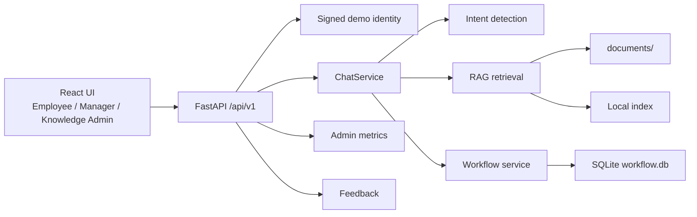

# AI HR Knowledge Assistant (MVP)


An AI assistant MVP for company knowledge, HR policy questions, and employee request workflows.

The demo is built around HR and IT policies because they are easy to understand in a portfolio review. The architecture itself is domain-agnostic: the same product pattern can support healthcare operations, construction teams, compliance departments, finance operations, field teams, or customer support teams that need document-grounded answers and lightweight internal workflows.

## Features

- Employee-facing AI chat with streaming answers
- Retrieval-augmented generation over internal documents
- Source citations with document title, section, category, version, and highlighted evidence
- Safe workflow creation for PTO, sick leave, and document requests
- Confirmation drawer before a request is submitted
- Manager inbox with filters, counters, approval/decline actions, comments, and status timeline
- Knowledge Admin dashboard for documents, indexing, unanswered questions, feedback, logs, and metrics
- Versioned `/api/v1` contract for a React frontend
- Demo authentication with predefined Employee, Manager, and Knowledge Admin roles
- Local-first setup with FastAPI, React, TypeScript, Vite, Tailwind CSS, SQLite, and OpenAI models

## Business Value

Internal teams repeatedly answer the same operational questions: policies, benefits, access requests, schedules, onboarding, compliance rules, safety procedures, and document requests.

This project demonstrates a practical internal assistant that does more than generate text:

- grounds answers in approved company documents;
- creates requests only after explicit user confirmation;
- gives managers a real approval queue instead of an unstructured chat transcript;
- gives knowledge admins visibility into documents, indexing state, unanswered questions, feedback, and answer quality;
- can be adapted to other industries by replacing documents, prompts, workflow types, and admin policies.

For a business reviewer, the value proposition is simple: reduce repetitive internal support work while keeping answers tied to approved materials and preserving a clear audit trail for actions.

## Product Surfaces

| Surface | Route | Purpose |
|---------|-------|---------|
| Employee Workspace | `/employee` | Ask policy questions, review sources, create confirmed workflow requests, send feedback. |
| Manager Inbox | `/manager` | Review submitted requests, approve/decline, leave comments, inspect timeline history. |
| Knowledge Admin | `/knowledge` | Monitor metrics, documents, indexing, feedback, unanswered questions, logs, and settings. |
| API Docs | `/docs` | Inspect and test the FastAPI contract. |

## Demo Accounts

The demo uses a safe local login flow. Arbitrary `User ID`, `X-User`, and free-form identity headers are not accepted by the active API.

| Username | Role | Main UI |
|----------|------|---------|
| `employee` | Employee | `/employee` |
| `manager` | Manager | `/manager` |
| `knowledge_admin` | Knowledge Admin | `/knowledge` |

The default local password is controlled by `DEMO_LOGIN_PASSWORD`. The included scripts use `demo-password` unless you override it.

## Project Structure

```text
.
|-- app.py                    # FastAPI entrypoint
|-- api/                      # Versioned API routes, schemas, and auth dependencies
|-- core/                     # Settings and environment helpers
|-- services/                 # Chat, auth, documents, logs, LLM wrapper, runtime wiring
|-- rag/                      # Prompts, retrieval, document indexing, evaluation helpers
|-- workflow.py               # SQLite workflow storage and event history
|-- frontend/                 # React SPA, design system, and role workspaces
|-- web_ui/                   # Legacy Streamlit reference implementation
|-- documents/                # Demo knowledge base documents
|-- docs/                     # API and architecture notes
|-- evals/                    # RAG evaluation set
|-- tests/                    # Backend and frontend-adjacent tests
|-- run_demo.ps1              # Starts API and React UI
|-- stop_demo.ps1             # Stops local demo services
|-- smoke_check.ps1           # Demo readiness validation
|-- requirements.txt          # Runtime Python dependencies
|-- requirements-dev.txt      # Test, lint, and formatting dependencies
|-- .env.example              # Example environment file
`-- README.md                 # This file
```

## Prerequisites

- Python 3.10+
- Node.js 22+
- An OpenAI API key
- Windows PowerShell for the included demo scripts
- Optional: Docker, if you want to run the API-only container

## Quickstart

1. Create and activate a virtual environment.

   Windows PowerShell:

   ```powershell
   python -m venv .venv
   .\.venv\Scripts\Activate.ps1
   ```

   macOS/Linux:

   ```bash
   python3 -m venv .venv
   source .venv/bin/activate
   ```

2. Create a local environment file.

   ```powershell
   Copy-Item .env.example .env
   ```

3. Edit `.env` and set at least `OPENAI_API_KEY`.

   For local-only demos, you can keep the default `DEMO_LOGIN_PASSWORD=demo-password`. For anything shared outside your machine, replace `DEMO_AUTH_SECRET` with a long random value.

4. Start the full local demo.

   ```powershell
   powershell -ExecutionPolicy Bypass -File .\run_demo.ps1 -InstallDeps -ForceRestart
   ```

5. Open the React UI.

   - React UI: http://127.0.0.1:5173
   - Employee: http://127.0.0.1:5173/employee
   - Manager: http://127.0.0.1:5173/manager
   - Knowledge Admin: http://127.0.0.1:5173/knowledge
   - API: http://127.0.0.1:8000
   - API health: http://127.0.0.1:8000/api/v1/health
   - API docs: http://127.0.0.1:8000/docs

6. Stop the demo.

   ```powershell
   powershell -ExecutionPolicy Bypass -File .\stop_demo.ps1
   ```

## Manual Development Run

If you prefer to run backend and frontend separately:

```powershell
pip install -r requirements-dev.txt
cd frontend
npm install
```

Start the API from the repository root:

```powershell
uvicorn app:app --reload --host 127.0.0.1 --port 8000
```

Start the React app from `frontend/`:

```powershell
$env:VITE_API_URL = "http://127.0.0.1:8000"
npm run dev -- --host 127.0.0.1 --port 5173
```

## Environment

The app reads configuration from environment variables via `.env`.

| Variable | Required | Default | Notes |
|----------|----------|---------|-------|
| `OPENAI_API_KEY` | Yes | - | OpenAI API key used for generation and embeddings. |
| `OPENAI_MODEL` | No | `gpt-5-nano-2025-08-07` | Explicit model snapshot used by the assistant. |
| `OPENAI_TIMEOUT_SECONDS` | No | `30` | OpenAI request timeout in seconds. |
| `OPENAI_MAX_RETRIES` | No | `2` | SDK retries for transient API failures. |
| `EMBEDDING_MODEL` | No | `text-embedding-3-small` | Embedding model for document retrieval. |
| `DEMO_AUTH_SECRET` | Yes | Development fallback | HMAC secret used to sign demo access tokens. |
| `DEMO_LOGIN_PASSWORD` | No | `demo-password` | Shared local password for predefined demo accounts. |
| `DEMO_TOKEN_TTL_SECONDS` | No | `28800` | Demo token lifetime in seconds. |
| `CORS_ORIGINS` | No | React localhost origins | Comma-separated allowed React origins. |
| `DOCUMENTS_DIR` | No | `documents` | Directory containing source documents. |
| `INDEX_PATH` | No | `data/index.json` | Local retrieval index path. |
| `INDEX_STATUS_PATH` | No | `data/index_status.json` | Local document indexing status path. |
| `LOG_PATH` | No | `data/chat_logs.jsonl` | Chat log path. |
| `WORKFLOW_DB` | No | `data/workflow.db` | SQLite workflow database path. |
| `SYSTEM_PROMPT_PATH` | No | `data/system_prompt.txt` | Runtime-editable system prompt path. |
| `LOG_USER_TEXT_MODE` | No | `masked` | Use `masked`, `raw`, or `off`. |
| `VITE_API_URL` | No | Same origin | API URL used by the React frontend in development/builds. |
| `API_BASE_URL` | No | `http://127.0.0.1:8000` | API URL used by the legacy Streamlit reference UI. |

## How It Works

- Employee, Manager, and Knowledge Admin sign in with predefined demo identities.
- Login returns an expiring signed Bearer token.
- The React UI communicates with the versioned `/api/v1` backend.
- `ChatService` classifies the message as a policy question, workflow action, or general assistant request.
- Policy questions go through the RAG layer, which retrieves relevant chunks from documents and sends grounded context to the model.
- Action-oriented messages prepare workflow drafts, but a request is created only after explicit confirmation.
- Workflow transitions are protected: invalid status changes are rejected, and every meaningful change is written to `request_events`.
- Managers can approve, decline with a required comment, add comments, and inspect the full timeline.
- Knowledge Admins can inspect documents, indexing state, unanswered questions, feedback, logs, system settings, and demo metrics.

## Architecture



More detail is available in [docs/ARCHITECTURE_OVERVIEW.md](docs/ARCHITECTURE_OVERVIEW.md).

## API Contract

The active backend contract is versioned under `/api/v1`.

Core routes:

- `POST /api/v1/auth/login`
- `GET /api/v1/me`
- `POST /api/v1/chat`
- `POST /api/v1/chat/stream`
- `GET /api/v1/requests`
- `POST /api/v1/requests`
- `GET /api/v1/requests/{id}`
- `POST /api/v1/requests/{id}/submit`
- `POST /api/v1/requests/{id}/approve`
- `POST /api/v1/requests/{id}/decline`
- `GET /api/v1/documents`
- `POST /api/v1/documents`
- `POST /api/v1/documents/{id}/index`
- `POST /api/v1/feedback`
- `GET /api/v1/admin/metrics`

Full API notes are available in [docs/API_ENDPOINTS.md](docs/API_ENDPOINTS.md).

## Example Questions

- What can you help with?
- How often are salaries paid?
- How far in advance should I request vacation?
- Can I request partial-day PTO?
- How do I request VPN access?
- I need vacation from 2030-04-10 to 2030-04-12

## Demo Flow

1. Sign in as `employee`.
2. Ask what the assistant can help with.
3. Ask a policy question about payroll, benefits, schedules, VPN access, or PTO.
4. Open sources and show the highlighted evidence excerpt.
5. Ask for vacation from `2030-04-10` to `2030-04-12`.
6. Review the prefilled drawer and submit the request.
7. Sign in as `manager`, open the submitted request, and approve or decline it.
8. Sign in as `knowledge_admin` and show metrics, documents, indexing state, unanswered questions, feedback, logs, and settings.

Detailed scripts are available in [DEMO_SCENARIOS.md](DEMO_SCENARIOS.md).

## Runtime Data and Git Hygiene

The repository intentionally does not commit local runtime state.

Tracked:

- source code;
- tests and evaluation fixtures;
- sample knowledge documents in `documents/`;
- `data/.gitkeep` only, so the runtime directory exists after clone.

Ignored:

- `.env` and local environment variants;
- `.demo_logs/` and `.demo_state/`;
- `data/workflow.db`;
- `data/chat_logs.jsonl`;
- `data/index.json`;
- `data/index_status.json`;
- `data/system_prompt.txt`;
- frontend build artifacts and `frontend/node_modules/`.

This means a fresh clone starts with a clean workflow database. New demo requests, manager comments, chat logs, feedback, and local indexes are generated on the developer's machine and should not be committed.

## Validation

Run the backend test suite, static checks, RAG evaluation, and frontend checks:

```powershell
python -m pytest -q
python -m ruff check .
python -m ruff format --check .
python -m scripts.run_rag_eval
cd frontend
npm test
npm run build
```

Before a live demo, run the smoke check:

```powershell
powershell -ExecutionPolicy Bypass -File .\smoke_check.ps1
```

The smoke check validates unit tests, RAG evaluation, API v1 login, role authorization, draft submission, manager approval, metrics, document IDs, and frontend build readiness.

## API-Only Docker Run

```powershell
docker build -t ai-hr-knowledge-assistant .
docker run --rm -p 8000:8000 --env-file .env ai-hr-knowledge-assistant
```

The Docker target is intentionally API-only. `run_demo.ps1` starts the API and the Vite React frontend for local presentation.

## Known Limitations

- Demo authentication is not a production SSO/OAuth integration.
- SQLite and file-based runtime state are used for local simplicity.
- The local retrieval index is suitable for an MVP demo, not for production-scale enterprise search.
- Document-level permissions and tenant isolation are not implemented.
- The workflow model is intentionally focused on a small set of request types.
- The legacy Streamlit UI remains as reference code, but the React app is the active presentation UI.

## Roadmap

- Add production authentication with SSO/OAuth and stronger role-based access control.
- Move workflow state to a production database.
- Replace the local JSON retrieval index with production search or vector storage.
- Add document permissions, audit exports, and admin change history.
- Expand request types and workflow configuration.
- Add deployment templates for a cloud environment.
- Turn the RAG evaluation set into a visible quality dashboard.

## Supporting Docs

- API summary: [docs/API_ENDPOINTS.md](docs/API_ENDPOINTS.md)
- Architecture overview: [docs/ARCHITECTURE_OVERVIEW.md](docs/ARCHITECTURE_OVERVIEW.md)
- Demo script: [DEMO_SCENARIOS.md](DEMO_SCENARIOS.md)

## Troubleshooting

- Missing API key: set `OPENAI_API_KEY` in `.env`.
- Demo login fails: check `DEMO_LOGIN_PASSWORD` and restart all services.
- API unavailable in the UI: confirm that http://127.0.0.1:8000/api/v1/health is healthy.
- Frontend cannot reach the API in manual mode: set `VITE_API_URL=http://127.0.0.1:8000`.
- Index is stale after document changes: sign in as `knowledge_admin` and run indexing from the Documents area.
- Demo services are already running: restart with `.\run_demo.ps1 -ForceRestart`.

## Privacy & Data Handling

- Source documents are stored locally in `documents/`.
- Workflow requests, audit events, manager comments, users, and feedback are stored in local SQLite.
- Chat logs are written to JSONL and can mask, store, or omit user text via `LOG_USER_TEXT_MODE`.
- When using OpenAI models, user questions and retrieved excerpts may be sent to the OpenAI API.
- Do not use sensitive production data in this MVP unless your data handling policies allow it.
