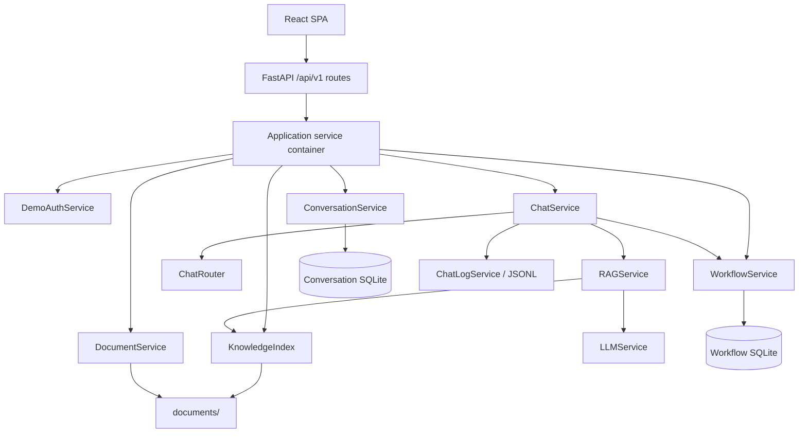

# Architecture overview

PeopleFlow AI is one React SPA and one FastAPI application with local SQLite/file persistence. Version 2.3 keeps the architecture explicit: HTTP, use cases, domain rules, persistence, and external AI are separate, but there is no framework-like repository hierarchy around simple files.

## Runtime graph



`app.create_app()` receives a service factory. FastAPI lifespan creates exactly one `ServiceContainer` for that application and places it in `app.state`. Routes receive it through a dependency. Tests pass a container backed by isolated temporary files; importing a route no longer initializes the real database, OpenAI client, or retrieval index.

The OpenAI client itself remains lazy inside `LLMService`, `Retriever`, and index creation. A missing key therefore does not prevent startup or deterministic testing.

## Boundaries

### HTTP boundary

`api/routes/` is split by capability:

- `system.py`: health, login, current identity;
- `chat.py`: history, synchronous chat, NDJSON streaming;
- `requests.py`: role-scoped request operations;
- `documents.py`: source files and global indexing;
- `admin.py`: feedback, gaps, metrics, and AI settings.

Routes convert Pydantic DTOs to service models and translate domain exceptions to HTTP responses. They do not construct services or directly update SQLite. `api/chat_adapter.py` keeps FastAPI/Pydantic types out of `ChatService`.

### Chat boundary

`ChatService` orchestrates deterministic routing, workflow preparation, RAG preparation, model generation, fallback selection, and outcome logging. Internal `ChatQuery`, `ChatOutcome`, and stream updates have no FastAPI dependency.

For streaming answers, `LLMService` yields real Responses API deltas. If a provider error happens before output, the fallback arrives as a normal token. If it happens after partial output, a `replace` event tells the client to discard the incomplete text. A terminal `complete` event is emitted only after the exchange has been stored successfully.

### Conversation boundary

`ConversationService.record_exchange()` owns conversation creation and both messages in one `BEGIN IMMEDIATE` transaction. A conversation does not exist until its first exchange succeeds. For existing chats, the API loads server-owned history instead of trusting a client-supplied transcript. Conversation state has its own SQLite file; the first 2.3 startup imports any older history that lived in the workflow database.

Assistant messages retain source evidence and a `workflow_request_id`. Conversation reads use that ID to fetch current workflow state. The original response remains an audit snapshot, while the visible card always reflects the latest request status.

If a chat-created workflow draft cannot be persisted with its exchange, the API compensates by deleting that still-unshared draft.

### Workflow boundary

Workflow code is divided by reason to change:

- `workflow_domain.py`: request types, transitions, field validation, and conservative text interpretation;
- `workflow_service.py`: owner/manager authorization and application use cases;
- `workflow_repository.py`: operational SQL and row mapping;
- `workflow_schema.py`: schema bootstrap and legacy database migrations;
- `workflow.py`: stable public imports for callers.

The public workflows are deliberately closed:

```text
PTO:        draft -> in_review -> approved | declined
Sick leave: draft -> reported  -> acknowledged
Either:     eligible non-final state -> cancelled by employee
```

The server derives the applicant and assigned manager from authenticated identity. Client payloads cannot redirect a request. Every status change and manager comment is recorded as an event.

Sick-leave-specific availability fields live in the shared request's `details` JSON object. That avoids parallel tables for five fields while preserving type-specific validation. Unsupported legacy request types are excluded from active reads and metrics.

### Document and retrieval boundary

`DocumentService` owns safe path resolution, upload/delete, stable IDs, index-status presentation, and byte snapshots. `KnowledgeIndex` owns source loading, corpus fingerprinting, index creation, embedding fallback/cooldown, and its retriever cache. Both receive concrete paths from the application container; there is no module-level default index.

An index represents the whole corpus, so the API exposes one global rebuild. Upload/delete behavior is transactional at the file boundary:

1. snapshot index and status bytes;
2. apply the source-file change;
3. rebuild the whole index to a temporary file and atomically replace it;
4. update exact current-document statuses;
5. on failure, restore source and index bytes and invalidate the in-process retriever.

Unreadable files fail strict indexing with a visible `503`; they are not silently omitted. Duplicate document content is skipped with a warning. If embedding creation fails, a lexical index is committed with `embedding_retry_at`; normal RAG traffic retries semantic indexing after the cooldown.

## Persistence

Two local SQLite databases keep lifecycle ownership explicit:

- conversation state contains `conversations` and `conversation_messages`;
- workflow state contains `workflow_requests`, `request_events`, and `request_comments`;
- workflow state also owns request feedback, anonymized assistant feedback, and persisted quality-review decisions.

Schema initialization is idempotent. `workflow_schema.py` migrates old workflow shapes/statuses, normalizes the demo manager identity, anonymizes old assistant feedback, removes the obsolete users table, and upgrades old sick-leave states.

Atomic JSON/byte helpers in `core/files.py` write a sibling temporary file, flush it, and replace the target. They are used for the knowledge index, index statuses, and the unified AI-settings/system-prompt file.

`ChatLogService` writes a separate quality signal log. User text can be masked, stored raw, or omitted. Metrics count authoritative conversation rows and their stored outcome codes rather than a capped slice of this log or the visibility of source cards; unanswered-item detection uses the same explicit outcome codes. A narrow display-text fallback remains only to read logs produced before outcome codes existed.

## Frontend structure

The SPA uses React Router, TanStack Query, Zod, Radix Dialog, Tailwind CSS, and Lucide icons.

- `api/client.ts` validates authentication and streamed event boundaries.
- Employee page orchestration is separate from sidebar, message, request-detail, and presentation modules.
- The request drawer owns one typed form object and delegates PTO/Sick Leave fields and confirmation visuals.
- Knowledge Admin is a thin section switcher over Overview, Documents, Quality, and AI Settings panels.
- route-level lazy loading keeps each role workspace out of the initial login bundle.

Server-state query keys include user identity where cross-login cache reuse would be unsafe. Native controls have explicit semantics and labels; Biome enforces the shared TypeScript/React style.

## Verification model

Backend tests construct a complete isolated service graph and exercise HTTP authorization, migrations, state transitions, conversation persistence/context, genuine stream behavior, index rollback, lexical retry, and semantic retrieval. Frontend tests cover role routing, request presentation/form derivation, restored conversation associations, and fragmented NDJSON parsing.

`smoke_check.ps1` adds a process-level pass: static checks, all tests, production frontend build, an isolated uvicorn instance, both workflow lifecycles, history, streaming, indexing, and metrics. GitHub Actions runs the deterministic gate on Python 3.10/3.12 and Node.js 22.
